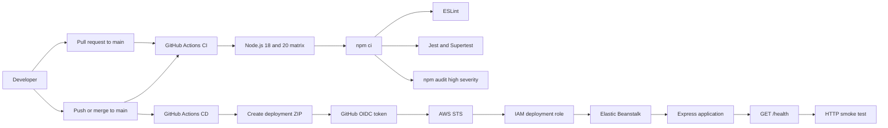

# Node.js DevOps portfolio

This portfolio project shows how a small Node.js API can be validated and deployed with GitHub Actions and AWS Elastic Beanstalk, a platform as a service (PaaS).

## Architecture



The Express app is separate from the process that starts the server. Jest and Supertest can test the app without opening a network port. The deployment entry point starts the server on the port Elastic Beanstalk provides.

## Deployment choice: native Node.js or containers?

This project uses native Node.js deployment on Elastic Beanstalk. For a small Express API, that keeps the package, runtime configuration, and deployment path simple. Elastic Beanstalk installs production dependencies from the package manifests on the application instances, so the workflow leaves `node_modules` out of the ZIP.

Containerizing the API would package its runtime and operating-system dependencies into an image. This can make local, CI, and production environments more consistent and make the workload easier to move between container platforms. It also adds work: the project would need a Dockerfile, image builds, a registry, image scanning, and a container runtime or orchestration service.

Neither option is always the right choice. Native deployment fits this small service and keeps the infrastructure easy to inspect. Containers become more useful when an application needs a custom runtime, multiple services, closer environment parity, or a platform that already uses images as its standard unit of deployment.

## Security practices

The CD workflow uses GitHub OpenID Connect (OIDC) instead of storing long-lived AWS access keys in GitHub. GitHub issues a short-lived identity token for the workflow. AWS Security Token Service (STS) exchanges that token for temporary credentials when the IAM role's trust policy accepts the repository and branch claims.

The trust policy should limit role assumption to this repository and its deployment branch:

```text
repo:Ja-Gia772473/node-native-devops-pipeline:ref:refs/heads/main
```

The workflow also requests only the permissions it needs for the GitHub token:

```yaml
permissions:
	id-token: write
	contents: read
```

The project also uses or recommends these practices:

- Limit the IAM trust policy and deployment permissions to the required repository, branch, AWS services, and resources.
- Use `npm ci` so CI installs the versions recorded in `package-lock.json`.
- Run `npm audit --audit-level=high` during CI, then review findings before deployment.
- Keep AWS account details and environment-specific settings in GitHub or AWS configuration when reusing the workflow across environments.
- Use HTTPS for the deployed health endpoint and make the smoke-test URL configurable.
- Do not place static AWS credentials in workflow files or repository secrets when OIDC can provide temporary credentials.

## Pipeline design

Pull requests targeting `main` and pushes to `main` run CI. The matrix checks the API on Node.js 18 and 20. Each job installs dependencies with `npm ci`, then runs ESLint, Jest, and the high-severity dependency audit.

Pushes to `main` also start CD. The workflow creates a versioned ZIP from `src`, `package.json`, and `package-lock.json`, authenticates to AWS with OIDC, deploys to Elastic Beanstalk, and checks `/health` for an HTTP 200 response.

Because this is a portfolio example, the workflow also makes a few areas for future hardening visible:

- Gate CD on a successful CI result so a failing validation run cannot deploy.
- Use one Elastic Beanstalk deployment mechanism consistently. The current workflow includes both an AWS CLI application-version command and a Beanstalk deployment action.
- Let AWS CLI failures fail the job instead of treating every failure as an existing version. Missing packages and permission errors should remain visible.
- Replace the fixed smoke-test delay with retries and keep the health URL in environment-specific configuration.
